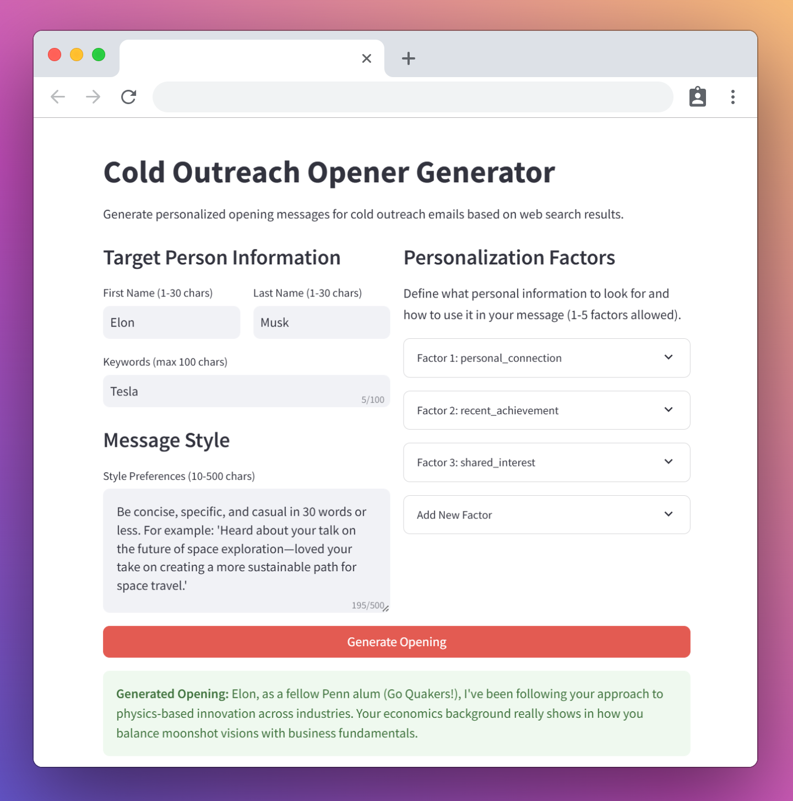

<h1 align="center">Cold Outreach Opener Generator</h1>


Doing a cold outreach campaign and want to grab attention from the first sentence? This Open Sourced LLM App instantly crafts personalized openers that boost opens and response rates.

<div align="center">
  
</div>


- Design Doc: [docs/design.md](docs/design.md), Flow Source Code: [flow.py](flow.py)

- **Built With:** [Pocket Flow](https://github.com/The-Pocket/PocketFlow), a 100-line LLM framework that lets LLM Agents build Apps for you

- I built this in **just a few hours** using Pocket Flow + Cursor AI, and you can, too.

- Step-by-Step YouTube Development Tutorial Coming soon! [Subscribe for notification](https://www.youtube.com/@ZacharyLLM?sub_confirmation=1)!
 
## How to Run

1. Implement `call_llm` in `utils/call_llm.py`, and `search_web` in `utils/search_web.py`.

2. Install the dependencies and run the program:
    ```bash
    pip install -r requirements.txt
    python main.py
    ```

3. To run the application server: 
    ```bash
    streamlit run app.py
    ```

4. If you want to generate personalized cold outreach openers for multiple people from a CSV file.

    ```bash
    python main_batch.py
    # Or with custom files
    python main_batch.py --input my_targets.csv --output my_results.csv
    ```

    CSV file with three required columns:
    - `first_name`: Target person's first name
    - `last_name`: Target person's last name
    - `keywords`: Space-separated keywords (e.g., "Tesla SpaceX entrepreneur")

    CSV file with original columns plus:
    - `opening_message`: Generated personalized message
    - `search_results`: Comma-separated list of URLs
    - For each personalization rule (e.g., personal_connection, recent_promotion, recent_talks):
    - `rule_actionable`: Whether the rule could be applied (True/False)
    - `rule_details`: Supporting details if rule was actionable 