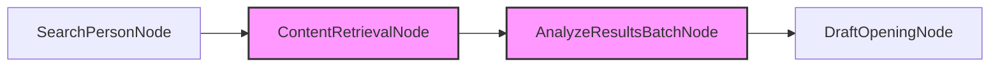

# Cold Outreach Opener Generator - Design Document

## 1. Project Requirements

The Cold Outreach Opener Generator creates personalized opening messages for cold outreach emails based on:

- **Target Person Information**: First name, last name, and space-separated keywords related to the person (e.g., "Tesla SpaceX entrepreneur")
- **Personalization Factors**: List of things to look for (e.g., personal connections, recent promotions, talks)Example factors:
    1. **Personal connection**: "If target person has Columbia University affiliation, mention our shared connection to Columbia"
    2. **Recent promotion**: "If target person was recently promoted, congratulate them on their new role"
    3. **Recent talks or publications**: "If target person gave talks recently, mention enjoying their insights"
- **Tone Preferences**: Desired message style (e.g., concise, friendly, casual)

## 2. Utility Functions

Following the "start small" principle, we've implemented these essential utility functions:

- `call_llm(prompt)` in `utils/call_llm.py`

- `search_web(query)` in `utils/search_web.py`
   - **Purpose**: General web search function to find information
   - **Input**: Search query string
   - **Output**: List of search results (snippets and URLs)
   - **Implementation**: Uses Google Custom Search API to perform searches

- `get_html_content(url)` in `utils/content_retrieval.py`
   - **Purpose**: Retrieve HTML content from a URL
   - **Input**: URL string
   - **Output**: HTML content or extracted text from the webpage
   - **Implementation**: Uses requests library to fetch content from the URL

## 3. Flow Architecture

Based on our utility functions, the flow will consist of these nodes:

### SearchPersonNode
- **Purpose**: Search for information about the target person
- **Design**: Regular Node
- **Data Access**:
  - **Prep**: Read first_name, last_name, keywords from shared store
  - **Exec**: Call search_web utility with a formatted query like "FirstName LastName Keywords" to retrieve top 10 URLs (note: keywords is a space-separated string, not a list)
  - **Post**: Write search results to shared store

### ContentRetrievalNode
- **Purpose**: Retrieve content from each search result URL
- **Design**: BatchNode (processes each URL separately)
- **Data Access**:
  - **Prep**: Read search results from shared store and return list of URLs
  - **Exec**: For each URL, call get_html_content; if retrieval fails, return empty content
  - **Post**: Write only non-empty webpage contents to shared store, filtering out failed retrievals

### AnalyzeResultsBatchNode
- **Purpose**: Analyze each webpage content for personalization factors
- **Design**: BatchNode (processes each URL content separately)
- **Data Access**:
  - **Prep**: Return list of (url, content) pairs from shared["webpage_contents"]
  - **Exec**: For each content, call LLM to analyze and extract relevant personalization details
  - **Post**: Combine all actionable personalization factors and write to shared store

### DraftOpeningNode
- **Purpose**: Generate personalized opening message
- **Design**: Regular Node
- **Data Access**:
  - **Prep**: Read target person info, actionable personalization factors, and style preferences
  - **Exec**: Call LLM to draft opening message based on the specified style
  - **Post**: Write draft opening message to shared store

## Flow Sequence




The diagram visually represents our flow, with batch nodes highlighted.

## 4. Data Schema

The shared store will contain:

```python
shared = {
    "input": {
        "first_name": str,        # Target person's first name
        "last_name": str,         # Target person's last name
        "keywords": str,          # Space-separated keywords related to the person
        "personalization_factors": list[dict],  # Things to watch for and corresponding actions
        "style": str              # Desired message style
    },
    "search_results": list[dict], # Results from web search
    "webpage_contents": dict,     # HTML/text content of relevant pages, keyed by URL
    "personalization": {
        # Each key corresponds to a found personalization factor
        "factor_name": {
            "actionable": bool,        # Whether the factor was actionable
            "details": str,       # Supporting details if actionable
            "action": str         # Corresponding action to take
        }
    },
    "output": {
        "opening_message": str    # The generated opening message
    }
}
```
